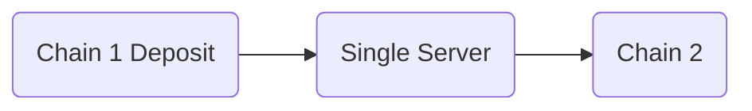
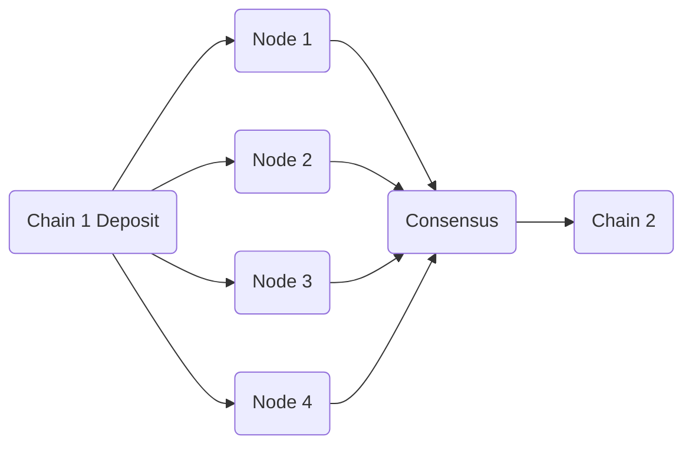
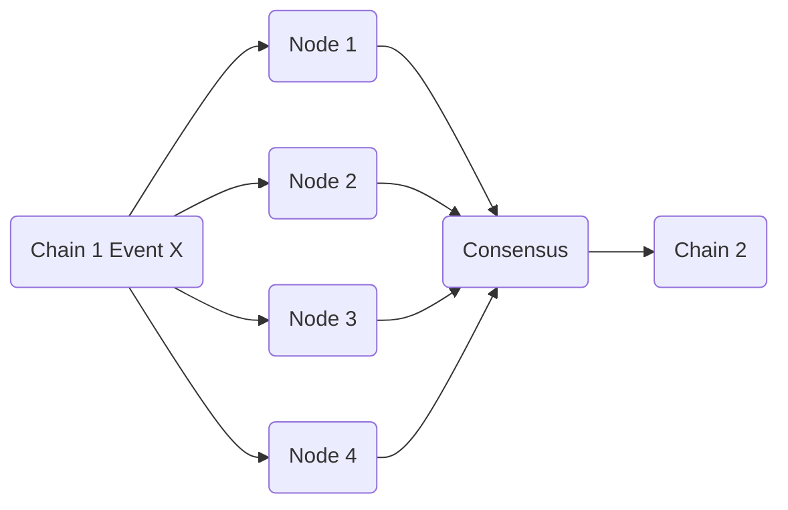

# Masked Bridging on Findora

We aim to provide masked bridging of assets from an EVM chain to their findora's anonymous wallet.
Findora's implementation ensures that the funds are not traceable back to it's source

## Technical Architecture

- Chainbridge core: Chainbridge currently provides bridging between EVM based to Substrate based chains. It uses a centralized system to
  detect deposit events and writes events on the other chain. We plan to fork the current implementation and upgrade it to support deposits to findora's anonymous wallet system.
- Triple Masking

## Stages of Development

1. Proof of Concept(MvP): Use of existing Chain Bridge core infrastructure to build upon. Support masked bridging by verifying deposit events

2. Decentralized system to detect Deposit events: Extend on the MvP to allow users to host nodes and verify deposit events, thereby reducing dependency.

3. Generalize the capability of decentralized nodes: Use decentralized nodes to verify a general event (apart from deposits) and write them to findora.

